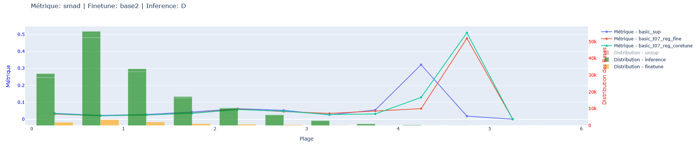

# stage_astro

## Contexte

L'univers est en constante expansion et il est nécessaire, pour le comprendre, de modéliser la toile cosmique ainsi que mesurer l'éloignement des différents corps célestes. Cela est possible en mesurant le *redshift* (décalage vers le rouge) qui quantifie l'éloignement des objets (similaire à l'effet Dopler). Le redshift peut être déduit à partir des magnitudes obersvées dans différentes longueurs d'ondes et de nombreux modèles de Machine Learning ont été appliqués à cette tâche, à partir des magnitudes extraites (D'Isanto et Polsterer 2017) ou bien directement de images (Pasquet et al. 2019). Cependant ces modèles sont très dépendants des données et un énorme biais dans la distribution des redshifts connus vient perturber l'apprentissage. En effet, il est très coûteux d'estimer des redshifts élevés de manière fiable (par spectrométrie) et l'estimation par photométrie (template-fitting et Machine Learning) est une alternative moins fiable mais moins coûteuse. Ce *shift* de distribution qui donne davantage de données labellisées à basses valeurs engendre une dégénérescence des modèle de Machine Learning à mesure que la valeur réponse augmente, l'objectif de ce stage était de proposer une solution au manque de robustesse des modèles classiques grâce à l'apprentissage non-supervisé. Les données non-labellisés n'étant pas biaisé dans leur distribution, il est en théorie possible d'apprendre des représentations robustes et transférables à la tâche down-stream de prédiction du redshift. 

## Les données

Les images utilisées sont issues d'un découpage opéré par les astrophysiciens du Laboratoire d'Astrophysique de Marseille, elles sont de taille 64 pixels par 64 dans 6 longueurs d'ondes observées (U, G, R, I, Z, Y). Elles sont tirées du survey COSMOS qui peut être divisé en COSMOS **DEEP** (D), l'extérieur du champs, et COSMOS **ULTRA-DEEP** (UD), l'intérieur du champ. Les données labellisées sont de l'ordre de 150000 pour COSMOS UD et 20000 pour COSMOS D, parmi les labels certains sont obtenus par template fitting sur du 30 bandes et bien que ce ne soit pas aussi fiable qu'une estimation par spectrométrie ils sont considérés comme de vrais labels. A cela s'ajoute 200000 images non-labellisées de UD et 700000 non-labellisées de D. Une normalisation propre aux images astrophysiques est appliquée avec la formule \(x' = sign(x) * (sqrt(abs(images)+1)-1) \).

## Méthode 

### Choix du modèle 

L'apprentissage non-supervisé, ou plutôt *auto-supervisé* (Self Supervised Learning) peut être décomposé en deux grandes familles que sont les méthodes contrastives dont l'objectif est de maximiser la similarité entre 2 augmentations d'une même image et l'apprentissage de représentation par tâches "pré-textes" (colorier une image, ré-organiser les patch...). La famille choisie ici est celle des modèles contrastifs, parmi eux figurent BYOL (Grill et al. 2020), SimCLR (Chen et al. 2020), BarlowTwins (Zbontar et al. 2021), VICReg (Bardes et al. 2021), DINOv2 (Oquab et al. 2023). Dans un premier temps nous avons opté pour BYOL qui a la particularité de ne pas avoir besoin d'exemples négatifs cependant le modèle s'est confronté au phénomène connu de *collapse* de par cette absence de contrainte sur les paires. Après avoir testé les trois framework de SimCLR, VICReg, et BarlowTwins qui permirent tous d'apprendre des représentation comportant l'information du redshift, c'est SimCLR qui a été choisi pour continuer. Le framework de DINOv2 aurait également pu être utilisé mais il nécessite énormément de ressources de calcul et n'est pas très modulable sur les augmentations de données. En effet, toutes ne s'appliquent pas à l'astrophysique étant donné que l'on doit garder les valeurs de canaux relativement intact pour ne pas modifier l'information du redshift ce qui n'est pas vraiment permis dans DINO avec les crops et masquage de patch, deplus l'utilisation de Dropout n'est pas vraiment adapté à la régression, le problème majeur reste la consommation de ressources.

### Procédure 

La première étape consistait donc à développer les frameworks contrastif et assurer l'apprentissage implicite du redshift, pour ce faire la visualisation des t-SNE s'est révélée très efficace. Donner les features à un classifier (XGBoost, MLP) est également possible, pour "pousser le vice", nous avons confirmé la qualité des features avec un KNN sur les coordonnées de la t-SNE.
Une fois le modèle pré-entrainé, nous avons posé 3 scénarios de finetuning : 5k, 10k et 20k données labellisées provenant de UD. Et 2 cas d'inférence : le reste des données UD, les données D.
L'objectif était de constater l'évolution des métriques astrophysiques (biais, déviance MAD et fraction d'outliers) sur différentes plages de redshift et conclure sur la robsutesse de ce type de modèle.

## Résultats

### Pré entrainement des modèles

Comme énoncé plus haut, l'apprentissage des représentations avec BYOL s'est soldé par un échec à cause du *collapse* des features qui tendaient vers un unique vecteur composé de très grandes valeurs. Cela vient en partie du fait que l'on utilise un réseau convolutif dépourvu de BatchNormalization car elle donne en pratique de moins bons résultats sur la prédiction du redshift (la variance ramenée à 1 est un régulariseur implicite des sorties d'une couche et aurait donc limité ce phénomène). L'avantage de SimCLR sur BYOL est l'utilisation de paires négatives qui forcent le modèle à apprendre des représentations discriminantes vis à vis des autres images du batch. Je suppose que c'est en lien avec cette volonté de "repousser" les vecteurs de paires négatives pour minimiser la loss de contraste mais le modèle tend tout de même à augmenter la dynamique de ses sorties (bien que la cosine similarité s'effectue avec normalisation des projections). L'ajout d'une Batch Normalization en fin d'extracteur résout en partie ce problème, en apparence en tout cas car la dynamique pré-BN continue d'augmenter, une solution alternative à cela a été d'ajouté une régularisation sur l'activité en sortie de la tête de projection et force ainsi le réseau à propager de petites valeurs tout le long (une régularisation L1-L2 a été utilisée).

<table>
  <tr>
    <td style="text-align: center;">
      <h4>SimCLR</h4>
      
    </td>
    <td style="text-align: center;">
      <h4>BarlowTwins</h4>
      
    </td>
    <td style="text-align: center;">
      <h4>VICReg</h4>
      
    </td>
  </tr>
</table>

Ce sont des résultats satisfaisant car on retrouve les hauts redshifts regroupés entre eux, idem pour les bas redshifts. Une solution pour forcer davantage l'apprentissage du redshift est l'utilisation d'une tête de régression branchée sur l'extracteur de caractéristiques, les couleurs sont obtenues comme la différence entre 2 canaux de l'images. Il y a donc 5 couleurs par image et on sait qu'il existe une relation entre la couleur et le redshift comme le montre Masters et al. (2015). 

La t-SNE comportant une partie aléatoire il n'est pas vraiment possible de tirer une conclusion sur l'utilité de la tête de régression mais certaines autres expériences ont montré un intérêt à l'ajouter, rien en tout cas ne montre d'intérêt à ne pas la mettre.

### Finetuning
A l'issue de ces étapes, on peut considérer l'espace latent appris par Self-Supervised comme de bonne qualité, comme prouvée par KNN sur la projection t-SNE (densité des y prédit en fonction des y réels proche de la droite y=x). Cependant un phénomène de *negative transfer* a été observé dans certaines configurations, en effet les représentations apprises pour la tâche non-supervisée ne sont pas forcément **directement** transférable à la prédiction du reshift. Encore une fois selon mon interprétation, la perte contrastive avec une température proche de 1 rend l'apprentissage plus dur car on obtient des logits entre [-1, 1] et qu'on applique ensuite un softmax pour trouver la paire positive, cela implique une presque impossibilité du modèle à discriminer la paire et donc une perte élevé, plus de mises à jour dans le réseau et donc moins de stabilité. Dans le premier cas la température était de 0.7 avec une loss d'environ 10, dans le cas d'une température de 0.1 comme dans les travaux d'Hayat et al. (2021) la loss s'optimise bien mieux aux environs de 0.6. Mais ce n'est pas tout, les features apprises par SSL ne garantissent aucune cohérence au sein d'une même classe car ce concept n'existe pas lors de l'apprentissage ainsi deux images appartenant à la même classe peuvent être opposées dans l'espace latent du moment qu'ils sont bien discriminés individuellement. C'est un problème que tente de résoudre Zhang et al. (2021) avec leur méthode core-tune qui permet de réorganiser l'espace latent pour prendre en compte les classes et en tirant profit de l'apprentissage non-supervisé c'est à dire en maximisant l'entropie sur l'hypersphère mais en minimisant l'entropie de chaque classe, produisant des classes compactes et discriminantes. Ces travaux visent à résoudre les limites de l'apprentissage Self-Supervised concernant les frontières de décision Sharp ainsi que la robustesse adversariale qui sont précisément les problèmes rencontrés ici, cependant cela a été pensé pour de la classification et s'adapte difficilement à de la régression.

En parallèle de ces constats sur le negative transfer, d'autres tests pour reproduire les résultats d'Hayat et al. ont été menés, résultants en beaucoup de modèles finetunés et d'inférence. Il est possible de les regrouper ainsi :

| **Modèle**         | **Régularisation**          | **Température NTXent** |
|-------------------|-----------------------------|------------------------|
| **CNN basiques**   | Avec activité               | 0.7 (SimCLR original)  |
|                   | Sans activité               | 0.7                    |
|                   | Avec activité               | 0.1 (Hayat et al.)     |
|                   | Sans activité               | 0.1                    |
| **ResNet50**       | Sans régularisation         | 0.7                    |
|                   | Sans régularisation         | 0.1                    |
| **ViT**            | Avec activité               | 0.7                    |
|                   | Sans activité               | 0.7                    |
|                   | Avec activité               | 0.1                    |
|                   | Sans activité               | 0.1                    |

<<<<<<< HEAD

Tous les modèles ont été entrainés avec des batch de taille 256, un optimiseur Adam initialisé à 10e-4 et divisé par 10 à 70 et 90 époques pour un total de 100 époques. Chaque modèle ayant vu 5k, 10k et 20k données labellisées issues de UD. Pour tenter de résoudre ces problèmes de frontières sharp, une version du finetuning durant lequel on maintient la perte contrastive a été implémenté ainsi qu'une version de core-tune bricolé pour convenir à la régression. L'évaluation se fait sur les 150 000 données restantes de UD et les 20000 de D à l'aides des métriques du biais, la déviance MAD et la fraction d'outliers.

Il est assez compliqué de montrer tous les résultats en ne surchargeant pas de graphiques aussi seul certains importants seront mis en avant et majoritairement en utilisant la déviance MAD qui nous intéresse le plus.

Premièrement concernant les baselines supervisées, on voit très rapidement que le ResNet50 n'est pas pertinent pour la prédiction du redshift, le CNN "basique" qui est en réalité très proche du réseau état de l'art dans la prédiction du redshift proposé par Treyer et al. (2021) est considéré comme le meilleur modèle bien que le ViT le surpasse sur la base 1, il se fait rapidement battre sur la 2ème base et cela ne fait que s'aggraver sur la 3ème
<table>
  <tr>
    <td style="text-align: center;">
      <h4>Base 1 (5k)</h4>
      
    </td>
    <td style="text-align: center;">
      <h4>Base 2 (10k)</h4>
      
    </td>
  </tr>
</table>

En ne considérant maintenant plus que les modèles "basiques" (avec régularisation qui surpasse assez fortement ceux sans), on peut s'interroger sur l'impact de la température.
De manière assez surprenante pour moi, c'est le modèle avec la température à 0.7 qui obtient de meilleurs résultats, sur toutes les métriques et toutes les plages. Un compromis est peut-être à trouver entre ces deux valeurs de températures, à 0.1 la température ne force pas assez le modèle à trouver des caractéristiques discriminantes là où je continue de penser que 0.7 force à en trouver des trop discriminantes pour les images astrophysiques et encourage les frontières sharp.

<table>
  <tr>
    <td style="text-align: center;">
      <h4>Base 1 (5k)</h4>
      
    </td>
  </tr>
</table>

Toujours dans l'optique de conserver le meilleur modèle, on peut maintenant s'intéresser aux variantes de ce finetuning avec la version qui maintient la loss de contraste et l'adaptation de core-tuning. Dans l'exemple ci-dessous on voit que la version avec la perte contrastive prend une valeur énorme entre 4.5 et 5 et ne peut donc pas être considérer comme le "meilleur modèle" cependant il faut noter qu'il y a très peu de données annotés au delà de 4.5, seulement 10 sur 5k, 16 pour 10k et 34 pour 20k.
Si on s'intéresse aux plages plus petites il est très compétitif avec les finetune classique (mais généralise un peu moins).

C'est presque l'inverse pour core-tune, si on fait attention au début de la distribution il performe moins bien que son homologue finetuné classiquement cependant il ne va pas présenter de pics de valeurs aberrantes.

<table>
  <tr>
    <td style="text-align: center;">
      <h4>Base 1 (5k) - finetune avec/sans contrastive et coretuning</h4>
      
    </td>
    <td style="text-align: center;">
      <h4>Base 1 (5k) - apport de core tuning</h4>
      
    </td>
    <td style="text-align: center;">
      <h4>Base 2 (10k) - apport de core tuning</h4>
      
    </td>
    <td style="text-align: center;">
      <h4>Base 3 (20k) - apport de core tuning</h4>
      
    </td>
  </tr>
</table>

Un autre effet très intéressant qui montre la robustesse de l'apprentissage non-supervisé est sur la métrique du biais, on voit très nettement l'intérêt du pré entrainement sur ce genre de cas.

<table>
  <tr>
    <td style="text-align: center;">
      <h4>Base 1 (5k) - biais de prédiction</h4>
      
    </td>
    <td style="text-align: center;">
      <h4>Base 2 (10k) - biais de prédiction</h4>
      
    </td>
    <td style="text-align: center;">
      <h4>Base 3 (20k) - biais de prédiction</h4>
      
    </td>
  </tr>
</table>

Pour finir, un dernier point intéressant est la capacité du modèle à transférer ses connaissances. Dans le cas présent il s'agit de la capacité à prédire sur un autre survey. Il aurait pu être intéressant de constater les performances sur un survey drastiquement différent mais la transférabilité de UD à D serait déjà un bon point, il existe d'autres problèmes de décalages entre les surveys que le self-supervised pourrait aider à résoudre mais qui n'ont pas été exploré ici. Comme il est possible de le voir, les modèles pré-entrainés en non supervisé tendent à réduire le biais (surtout le finetune classique en base 1) et à mesure que les données labellisées augmentent les performances deviennent similaires, c'est possiblement dû à l'apprentissage non-supervisé qui "s'oublie" au détriment du supervisé mais surtout le modèle purement supervisé qui généralise de mieux en mieux, c'est une conclusion assez classique que les modèles finetunés se font rapidement rattrapés par le pur supervisé. Un zoom sur l'intervale [0, 4] est fourni sur la base 2 pour mieux distinguer les courbes et tenter de montrer l'intérêt de core-tune, bien qu'il soit difficile de dire si la différence est significative

<table>
  <tr>
    <td style="text-align: center;">
      <h4>Base 1 (5k) - biais de prédiction (D)</h4>
      
    </td>
    <td style="text-align: center;">
      <h4>Base 2 (10k) - biais de prédiction (D)</h4>
      
    </td>
    <td style="text-align: center;">
      <h4>Base 2 (10k) - biais de prédiction (D) zoomé sur [0, 4]</h4>
      
    </td>
    <td style="text-align: center;">
      <h4>Base 3 (20k) - biais de prédiction (D)</h4>
      
    </td>
  </tr>
</table>

Idem pour la déviance MAD, les résultats ressemblent beaucoup à ceux sur UD et il est compliqué de juger leur significativité. Malgré tout l'entrainement non-supervisé semble être une bonne solution pour finir une pré initialisation robuste avant le finetuning sur une petite base de données.

<table>
  <tr>
    <td style="text-align: center;">
      <h4>Base 1 (5k) - biais de prédiction</h4>
      
    </td>
    <td style="text-align: center;">
      <h4>Base 2 (10k) - biais de prédiction</h4>
      
    </td>
    <td style="text-align: center;">
      <h4>Base 2 (10k) - biais de prédiction</h4>
      
    </td>
    <td style="text-align: center;">
      <h4>Base 3 (20k) - biais de prédiction</h4>
      
    </td>
  </tr>
</table>

=======
>>>>>>> f6b2762beb601308161e6005798af85ab0c05efd
